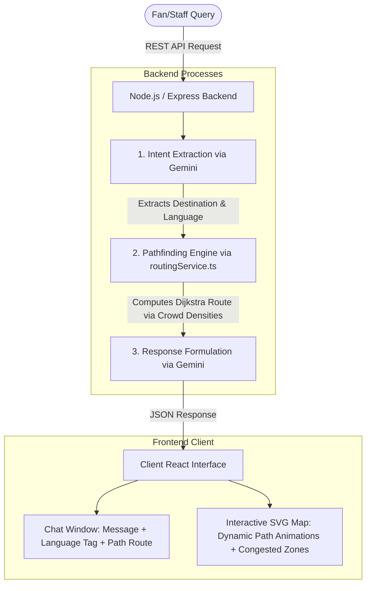

# 🏟️ Stadium Copilot — FIFA World Cup 2026 Smart Stadium Assistant

**Stadium Copilot** is a multilingual, GenAI-powered real-time assistant built for fans and staff at the FIFA World Cup 2026. Designed as a web application accessible instantly via QR codes (with no installation required), it helps visitors navigate the stadium grounds in their native language while dynamically avoiding high-congestion zones.

This project is a hackathon MVP built for **PromptWars Virtual (Challenge 4: Smart Stadiums & Tournament Operations)**.

---

## 🚀 Quick Start

To bootstrap and run the full stack locally:

```bash
# 1. Install dependencies across all workspaces
npm install

# 2. Add your Gemini API Key in the backend environment
# Edit apps/backend/.env and add:
# GEMINI_API_KEY=your_actual_api_key_here

# 3. Boot both the client and server concurrently
npm run dev
```

- **Frontend client** runs on `http://localhost:5173/`
- **Backend API server** runs on `http://localhost:3000/`

---

## 🛠️ Tech Stack & Workspace Structure

- **Monorepo Manager**: npm workspaces
- **Frontend**: React 18, Vite, TypeScript, Tailwind CSS, Heroicons
- **Backend**: Node.js, Express, TypeScript, dotenv
- **AI Integration**: Google Gemini SDK (`@google/generative-ai`)
- **Models**: `gemini-3.5-flash` (Primary) with automated fallback to `gemini-flash-latest` (which aliases the latest stable Flash release)
- **Testing**: Vitest + jsdom (Frontend), Jest + Supertest (Backend)
- **Deployment**: Ready for Docker + Google Cloud Run (configurations included)

---

## 🏛️ Architecture Overview

The system operates as a unified closed loop utilizing graph pathfinding grounded by LLM context generation:



---

## 📊 Mocked vs. Real (Hackathon Scope Disclosure)

Honesty and clear boundaries are crucial for a solid MVP:

*   **Real / Functional**:
    *   **Dijkstra Pathfinding**: The backend routing engine executes a mathematically correct Dijkstra pathfinding search over the 18-node stadium graph.
    *   **Dynamic Weighting**: Edge weights are calculated in real-time as `baseWeight + congestionPenalty`. The path actively alters its routing to circumvent congested nodes.
    *   **Gemini Integration**: True LLM calls utilizing `@google/generative-ai` with system instructions for query parsing, automatic language detection/translation, and response grounding.
    *   **Web Speech API**: Real microphone speech input inside the browser translating speak query to text.
    *   **Responsive Client**: A mobile-first UI with tab navigation that transforms into a split-screen dashboard on desktop view.
    *   **Offline Mode**: If no `GEMINI_API_KEY` is provided, a mock LLM heuristic service intercepts queries and routes to allow immediate layout and UI testing.
    *   **Staff Operations Logging**: An internal dashboard converting free-text or voice-transcribed logs into structured operational tickets (categorized, prioritized, and summarized).
*   **Mocked / Simulated**:
    *   **Incident Dispatch & Routing**: Incident routing, push alerts, and physical dispatching of emergency personnel or response teams are simulated and out of scope. Reports are logged in-memory only.

---

## 🛡️ Staff Mode (Incident Reporting Pipeline)

Stadium Copilot features an internal operations workspace dedicated to volunteers and stadium staff:
1. **Passcode Gate & Session Authentication**: Access to the Staff panel is protected by a passcode gate. The passcode is verified securely on the backend using timing-safe comparisons (`crypto.timingSafeEqual`) to prevent timing attacks. On verification, a short-lived session token (4-hour lifetime) is generated, which must be passed in the `Authorization: Bearer <token>` header for subsequent report submissions and polling. The token is stored strictly in frontend memory and cleared upon page reload, tab close, or manual logout.
2. **Free-Text & Voice Reporting**: Staff members can type or use the **Web Speech API** microphone voice input to describe issues they observe (e.g. medical emergencies, facility leaks, crowd blocks).
3. **GenAI Structuring Pipeline**: The text is parsed by Gemini via a specialized operational instruction set. It extracts and standardizes:
   - **Category**: Classifies incidents into exactly one of `crowding`, `medical`, `security`, `facility`, or `other`.
   - **Location**: Maps the description to the closest known node from the stadium layout graph (e.g., matching "leaking toilet" to "Restroom 2").
   - **Urgency**: Detects urgency level (`low`, `medium`, `high`) conservatively. Any query referring to injuries, bleeding, violence, danger, or weapons is automatically flagged as `high`.
   - **Summary**: Creates a clean, single-sentence summary of the ticket.
4. **Live Operations Feed & Active Alerts**: Logged incidents are dynamically loaded into an operational status feed, polling every 5 seconds to provide staff with a real-time ticketing dashboard. High-urgency incidents reported in the last 15 minutes are prominently highlighted at the top of the Staff Panel in a dedicated **Active Emergency Alerts** section with visual warnings and a pulse animation.
5. **Jumbotron Ticker Integration**: Active high-urgency incidents are pushed to a public ticker banner, prefixed with `OPS ALERT: [incident summary] (Location: [incident location])`, merging seamlessly with crowd density alerts or defaulting to a status message if all is clear.

---

## 🚨 Emergency Footer

To ensure fan safety, a persistent **Emergency Numbers Footer** is displayed at the bottom of the client application across all fan-facing views (Assistant, Reunite, and Map screens), but hidden inside Staff mode. It shows direct contacts for:
- **Primary emergency dispatch**: `911`
- **Venue operations security**: `Stadium Security: Ext. 4357` (configured in [EmergencyFooter.tsx](file:///d:/Promtwars/Stadium%20Copilot/apps/frontend/src/components/EmergencyFooter.tsx))

---

## ⚙️ Environment Variables

The workspace uses the following environment variables. Example configurations are provided in the respective `.env.example` files:

### Backend (`apps/backend/.env`)
- `PORT`: Port on which the API server runs (default: `3000`).
- `GEMINI_API_KEY`: Your Google Gemini API Key for processing queries and incident logs.
- `STAFF_ACCESS_CODE`: The secret passcode used to access the staff panel (e.g. `demo-passcode`).
- `STAFF_TOKEN_SECRET`: HMAC signing secret used for session tokens.

### Frontend (`apps/frontend/.env`)
- `VITE_STAFF_DEMO_CODE_HINT`: Displays the passcode hint directly below the input field on the Staff login page for evaluation/demo purposes. **This environment variable must be left unset in production deployments** to hide the hint.


---

## 👥 "Reunite" Group Meetup Algorithm

The "Reunite" mode helps groups of 2-4 fans find the most convenient meeting spot inside the stadium:
1.  **Minimax Optimization**: For every node in the stadium graph, the system calculates the congestion-weighted travel time for each group member from their current location using Dijkstra's algorithm.
2.  **No Fan Left Behind**: It scores each candidate node by its **maximum** travel time among all members. The algorithm then selects the node that minimizes this maximum time (minimax). This ensures the group converges on a spot that minimizes the waiting time of the furthest member.
3.  **Tie Breaking**: If multiple nodes yield the same maximum travel time, the system breaks ties by selecting the node that minimizes the **total sum** of travel times for all members.

---

## 🌐 Enterprise Differentiation & Position

**Stadium Copilot** is designed as a lightweight, group-aware, and multilingual fan-companion overlay. It is **not** a replacement for FIFA's official enterprise stadium digital-twin navigation systems, which integrate with full building management software (BMS), high-accuracy IoT beacon arrays, and internal security operations. Instead, Stadium Copilot acts as a crowd-sourced or API-integrated client layer, putting GenAI-powered translation and peer-to-peer group coordinating tools directly into fans' hands via simple QR scans.

---

## 📦 Deployment Options

This monorepo supports two deployment pathways:

### 1. Vercel Single-Deployment (Frontend + Serverless Backend)

The entire application can be deployed as a single Vercel project using the workspace configuration defined in [vercel.json](file:///d:/Promtwars/Stadium%20Copilot/vercel.json):

- **Build Target**: The frontend is compiled and served as a static single-page application (SPA) at the root domain (`/`).
- **Serverless Backend**: The Express application routes all `/api/*` requests to a serverless function adapter ([api/index.ts](file:///d:/Promtwars/Stadium%20Copilot/api/index.ts)).
- **Environment Variables**: Configure the following Environment Variable in your Vercel Project Dashboard:
  - `GEMINI_API_KEY`: Your Google Gemini API Key.
- **Crowd Simulator Behavioral Adjustments**: On Vercel, the backend automatically detects the stateless serverless environment and disables the persistent `setInterval` daemon. Instead, it dynamically generates deterministic and realistic crowd densities using a 10-second time-bucketed seed, ensuring the interactive map routes fans dynamic paths reliably.

### 2. Docker & Google Cloud Run (Alternative Deployment)

The pre-existing containerized setup is still valid and fully supported as an alternative deployment target:
- Backend Docker configurations and Dockerfiles are located under the `docker/` directory for long-running container environments.
- This path preserves persistent in-memory states and background update intervals.

